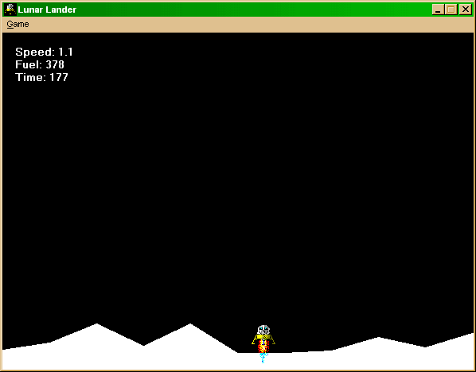

<div align="center">

## VbLander Game


</div>

### Description

This example will show you how to make fast and hi-quality windows games by using basic GDI functions, no VB controls like lines, picture boxes or such stuff. You will learn how to use bitmaps, how to draw them, load them into memory, how to use DC, create them, draw on them, etc. It is a simple Lunar Lander game, screenshot is included if you want to see the game. If you want to make proffesional 2d games that can be played at any computer, have a look at this example... 15kb only ;)
 
### More Info
 


<span>             |<span>
---                |---
**Submitted On**   |2004-06-20 21:55:56
**By**             |[TheAlas\.com](https://github.com/Planet-Source-Code/PSCIndex/blob/master/ByAuthor/thealas-com.md)
**Level**          |Intermediate
**User Rating**    |5.0 (10 globes from 2 users)
**Compatibility**  |VB 4\.0 \(16\-bit\), VB 4\.0 \(32\-bit\), VB 5\.0, VB 6\.0
**Category**       |[Games](https://github.com/Planet-Source-Code/PSCIndex/blob/master/ByCategory/games__1-38.md)
**World**          |[Visual Basic](https://github.com/Planet-Source-Code/PSCIndex/blob/master/ByWorld/visual-basic.md)
**Archive File**   |[VbLander\_G1760776222004\.zip](https://github.com/Planet-Source-Code/thealas-com-vblander-game__1-54547/archive/master.zip)

### API Declarations

```
' Copy DC's by using many advanced methods
Public Declare Function BitBlt Lib "gdi32" (ByVal hDestDC As Long, ByVal x As Long, ByVal y As Long, ByVal nWidth As Long, ByVal nHeight As Long, ByVal hSrcDC As Long, ByVal xSrc As Long, ByVal ySrc As Long, ByVal dwRop As Long) As Long
' Select GDI object, basic GDI function
Public Declare Function SelectObject Lib "gdi32" (ByVal hdc As Long, ByVal hObject As Long) As Long
' Delete object to free memory
Public Declare Function DeleteObject Lib "gdi32" (ByVal hObject As Long) As Long
' Create DC that is compatible with device
Public Declare Function CreateCompatibleDC Lib "gdi32" (ByVal hdc As Long) As Long
' Delete DC from memory
Public Declare Function DeleteDC Lib "gdi32" (ByVal hdc As Long) As Long
' GetObject, used to retrieve BITMAP object form StdPicture's handle
Public Declare Function GetObjectA Lib "gdi32" (ByVal hObject As Long, ByVal nCount As Long, lpObject As Any) As Long
' Simple api to create DIB section, nice stuff
Public Declare Function CreateDIBSection Lib "gdi32" (ByVal hdc As Long, pBitmapInfo As HBITMAPINFOHEADER, ByVal un As Long, lplpVoid As Long, ByVal handle As Long, ByVal dw As Long) As Long
' Draws a pixel anywhere on the screen, DC that is...
Public Declare Function SetPixel Lib "gdi32" (ByVal hdc As Long, ByVal x As Long, ByVal y As Long, ByVal crColor As Long) As Long
' Gets any visible pixel's color
Public Declare Function GetPixel Lib "gdi32" (ByVal hdc As Long, ByVal x As Long, ByVal y As Long) As Long
' Gets current mouse cursor position
Public Declare Function GetCursorPos Lib "user32" (lpPoint As POINTAPI) As Long
' Get the miliseconds interval sense windows stared
Public Declare Function GetTickCount Lib "kernel32" () As Long
' If a certain key was pressed or released
Public Declare Function GetKeyState Lib "user32" (ByVal nVirtKey As Long) As Integer
' Change current position on some DC, used for lines mostly...
Public Declare Function MoveToEx Lib "gdi32" (ByVal hdc As Long, ByVal x As Long, ByVal y As Long, lpPoint As POINTAPI) As Long
' Draw a line to a specified point, begins at the currently selected point (from MoveTo function)
Public Declare Function LineTo Lib "gdi32" (ByVal hdc As Long, ByVal x As Long, ByVal y As Long) As Long
' Creates a pen for drawing
Public Declare Function CreatePen Lib "gdi32" (ByVal nPenStyle As Long, ByVal nWidth As Long, ByVal crColor As Long) As Long
' Fill and area (specified color) with currently selected color
Public Declare Function ExtFloodFill Lib "gdi32" (ByVal hdc As Long, ByVal x As Long, ByVal y As Long, ByVal crColor As Long, ByVal wFillType As Long) As Long
' Draw text on DC with currently selected font
Public Declare Function TextOut Lib "gdi32" Alias "TextOutA" (ByVal hdc As Long, ByVal x As Long, ByVal y As Long, ByVal lpString As String, ByVal nCount As Long) As Long
' Change background mode, mostly for text operations
Public Declare Function SetBkMode Lib "gdi32" (ByVal hdc As Long, ByVal nBkMode As Long) As Long
```


